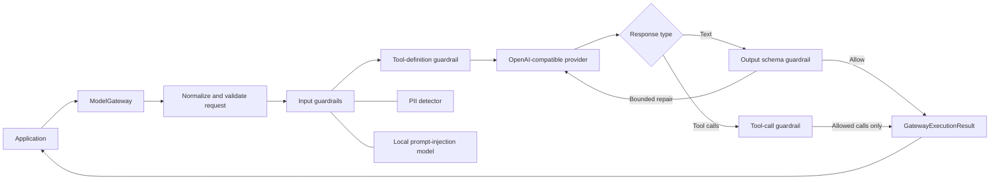

# Sentinel

**An in-process safety gateway for AI applications.**

Sentinel is a TypeScript SDK that sits between an application and an
OpenAI-compatible model provider. It inspects input, removes or blocks
sensitive data, detects prompt injection with a local ONNX classifier, validates
structured output, and filters tool calls before they reach application code.

It is a library, not a hosted proxy. Sentinel starts no HTTP server, stores no
prompts, and requires no external guardrail service.

> [!IMPORTANT]
> Sentinel is currently a private, pre-release workspace package. It is not yet
> published to a package registry. The supported package entry after a local
> build is `@llm-gateway/sdk`.

[SDK quick start](#sdk-quick-start) · [Use cases](#use-cases) ·
[Architecture](#architecture) · [Policies](#guardrail-policy) ·
[Full SDK reference](apps/gateway/README.md) ·
[Frontend](apps/frontend)

## Why Sentinel?

Calling a model API directly makes the application responsible for every
boundary around that call: personal data in prompts, malicious instructions,
unreliable structured responses, unsafe tool requests, provider-specific error
shapes, and operational visibility.

Sentinel puts those concerns on one explicit request path:

- **Local PII protection** — detect, redact, allow, or block supported personal
  data and credential formats before provider dispatch.
- **Local prompt-injection detection** — run a sealed ONNX model in shadow or
  enforcement mode without sending prompts to a second service.
- **Strict structured output** — validate JSON responses against a compiled
  schema and optionally make bounded repair attempts.
- **Tool-call boundaries** — filter offered tools and returned calls using a
  policy; Sentinel never executes tools itself.
- **Provider-neutral interface** — keep application code behind one typed chat
  completions API.
- **Observable lifecycle** — receive timing, decisions, rule IDs, and lifecycle
  stages without logging complete prompt or response content by default.

## Use cases

### Customer-facing AI features

Redact emails, phone numbers, payment-card numbers, database URLs, and supported
credentials before customer messages reach a third-party provider.

### Internal copilots and knowledge assistants

Detect prompt-injection attempts in untrusted content before they can influence
an assistant with access to internal context or tools.

### Agent and tool workflows

Expose only approved function definitions to the model, validate returned JSON
arguments against strict schemas, and return allowed calls to a fixed
application-owned tool registry.

### Structured automation

Require model output to match a JSON Schema before downstream business logic
uses it. Invalid output can be blocked or retried with a bounded repair prompt.

### Provider abstraction

Use the same SDK contract with OpenAI-compatible endpoints while keeping
timeouts, upstream error normalization, guardrails, and lifecycle reporting in
one place.

### Safe guardrail rollout

Run the prompt-injection classifier with `action.type: allow` to collect
sanitized shadow-mode decisions before changing the policy to enforce blocking.

## Architecture

Sentinel runs inside the consuming Bun or Node.js process. The application
constructs one `ModelGateway`, loads an optional YAML policy at startup, and
calls a provider-neutral completion method.



### Request lifecycle

The normal guarded request path is:

1. Normalize input and resolve the model and request ID.
2. Validate messages, tool definitions, and prior tool-call history.
3. Evaluate input guardrails. A block stops the request before provider access;
   a redaction replaces the provider-bound request.
4. Filter tool definitions that policy does not allow.
5. Call the configured model provider.
6. Validate returned tool calls or structured text output.
7. Optionally make a bounded output-repair request.
8. Return the model response, guarded provider request, context, duration, and
   lifecycle events.

Input decisions use the precedence `block > redact > allow`. Tool and output
failures never cause Sentinel to execute a tool or return an invalid result as
if it had passed.

### Main components

| Component                   | Responsibility                                                     |
| --------------------------- | ------------------------------------------------------------------ |
| `ModelGateway`              | Public SDK entry point and `chat.completions` resource             |
| `GatewayPipeline`           | Request normalization, guardrail ordering, retries, and lifecycle  |
| `ConfiguredGuardrailHub`    | Combines input, output, and tool policy behavior                   |
| PII detector                | Local structural detection and deterministic redaction             |
| Prompt-injection classifier | Sealed, local ONNX inference with bounded windowing                |
| Output evaluator            | Strict JSON Schema validation and repair decisions                 |
| Tool evaluator              | Definition filtering, call-schema validation, and policy filtering |
| `OpenAICompatibleProvider`  | Chat Completions adapter and upstream error normalization          |

### Trust boundaries

- PII detection and prompt-injection inference are local.
- Only the guarded request is sent to the configured provider.
- The ONNX model is verified against a sealed runtime manifest during startup.
- Policies and schemas are loaded and validated before the gateway is ready.
- Logging is silent by default and lifecycle metadata excludes full prompt and
  response bodies.
- `providerRequest` is returned for inspection but may still contain prompt
  data; do not persist it without an explicit privacy decision.
- Sentinel filters tool calls but does not provide authorization, a shell
  sandbox, or tool execution.

## Repository layout

```text
sentinel/
├── apps/
│   ├── gateway/        # @llm-gateway/sdk source, policies, tests, and design docs
│   ├── model/          # sealed prompt-injection ONNX artifact and manifests
│   └── frontend/       # Sentinel landing page and browser-based playground
├── package.json        # Bun workspace and Turbo tasks
├── turbo.json
└── README.md
```

## Setup

### Requirements

- Bun 1.3+ for workspace installation, repository scripts, and tests.
- Node.js 20+ or Bun 1.3+ to run the built SDK.
- A server-side runtime supported by `onnxruntime-node` when prompt-injection
  protection is enabled.
- An OpenAI-compatible model endpoint.
- An API key if that endpoint requires one.

Native prompt-injection inference is not supported in browsers or edge
runtimes.

### Install the workspace

```bash
git clone https://github.com/24aysh/sentinel.git
cd sentinel
bun install
```

### Build and validate

Run the workspace checks from the repository root:

```bash
bun run build
bun run lint
bun run check-types
```

Validate the SDK as a consumer would receive it:

```bash
cd apps/gateway
bun run check:package
```

`check:package` builds the package and checks its declarations, Node and Bun
imports, clean-artifact behavior, and absence of unwanted import side effects.

### Run the frontend

```bash
cd apps/frontend
bun run dev
```

The landing page includes an in-browser demonstration of PII redaction and
prompt-injection blocking. The demo does not send its prompt to a model. SDK
documentation is also available at `/docs`.

## SDK quick start

### 1. Add the workspace package

Until Sentinel is published, consume `@llm-gateway/sdk` as a workspace or
locally linked package after building `apps/gateway`.

For another package in this monorepo, add the workspace dependency:

```json
{
  "dependencies": {
    "@llm-gateway/sdk": "workspace:*"
  }
}
```

### 2. Create the gateway once

```ts
import { ModelGateway, OpenAICompatibleProvider } from "@llm-gateway/sdk";

const provider = new OpenAICompatibleProvider({
  baseUrl: process.env.MODEL_BASE_URL ?? "https://api.openai.com/v1",
  apiKey: process.env.MODEL_API_KEY,
  timeoutMs: 30_000,
});

const gateway = await ModelGateway.create({
  provider,
  defaultModel: process.env.MODEL_DEFAULT ?? "gpt-4.1-mini",
  policyPath: "apps/gateway/policies/example-policy.yaml",
  policyWorkingDirectory: process.cwd(),
  promptInjectionModelPath: "apps/model",
});
```

Create the gateway during application startup rather than for every request.
Policy loading, schema compilation, ONNX session initialization, and model
warmup happen before `ModelGateway.create()` resolves.

Omit `policyPath` to run without guardrails. A policy with `enabled: false` is
validated but not attached to the gateway.

### 3. Send a completion

```ts
const result = await gateway.chat.completions.create(
  {
    messages: [
      { role: "system", content: "You are a concise support assistant." },
      { role: "user", content: "Email the summary to ava@example.com" },
    ],
    temperature: 0.2,
    maxTokens: 300,
  },
  { requestId: "support-42" },
);

console.log(result.response.choices[0]?.message.content);
console.log(result.durationMs);
console.log(result.lifecycle);
```

The canonical operation is:

```ts
gateway.chat.completions.create(input, options);
```

SDK inputs use camel case, including `maxTokens`, `toolChoice`, and
`parallelToolCalls`. Text completions and non-streaming function calls are
supported.

### Result shape

```ts
interface GatewayExecutionResult {
  response: ChatResponse;
  providerRequest: ChatRequest;
  context: RequestContext;
  durationMs: number;
  lifecycle: readonly LifecycleEvent[];
  toolGuardrails?: {
    decision: "allow" | "filter";
    allowedCallCount: number;
    blockedCallCount: number;
    ruleIds: string[];
  };
}
```

`response` is the final guarded response. `providerRequest` is the request sent
on the first provider attempt after input redaction and tool-definition
filtering.

## Guardrail policy

Guardrails are configured in YAML and validated strictly at startup. Unknown
fields, invalid identifiers, duplicate rules, unsupported entities, unsafe
schema references, and incompatible actions fail construction.

```yaml
apiVersion: guardrails/v1
kind: GuardrailPolicy
enabled: true

metadata:
  name: application-policy
  version: 1

defaults:
  input_action: allow
  input_execution_mode: sequential
  runtime_failure_mode: closed
  maximum_retries: 1

input:
  - id: redact-personal-data
    detector: pii
    entities:
      - EMAIL
      - PHONE_NUMBER
      - API_KEY
      - CREDIT_CARD
    roles: [user]
    action:
      type: redact

  - id: block-prompt-injection
    detector: prompt_injection
    roles: [user]
    action:
      type: block
```

### Policy switches and failure modes

- `enabled: true` attaches the validated policy.
- `enabled: false` validates the policy but bypasses guardrails.
- Omitting `policyPath` constructs a gateway without guardrails.
- `runtime_failure_mode: closed` blocks when guardrail evaluation fails.
- `runtime_failure_mode: open` records the failure and permits the request when
  a safe fallback result is available.
- `input_execution_mode: sequential` runs prompt-injection inference after PII
  handling.
- `input_execution_mode: parallel` starts the detectors together, reducing
  latency at the cost of allowing raw PII into local tokenizer and ONNX memory.

Sequential mode is the privacy-first default.

## Input guardrails

### PII and credential protection

The local structural detector supports:

| Entity                       | Examples of covered values                                |
| ---------------------------- | --------------------------------------------------------- |
| `EMAIL`                      | Structurally valid email addresses                        |
| `PHONE_NUMBER`               | Plausible national and international numbers              |
| `IP_ADDRESS`                 | IPv4 and IPv6 addresses                                   |
| `API_KEY`                    | Recognizable provider keys and contextual generic secrets |
| `JWT`                        | Structurally valid signed JSON Web Tokens                 |
| `PRIVATE_KEY`                | Supported PEM private-key blocks                          |
| `CLOUD_CREDENTIAL`           | Recognizable AWS, Google, and Azure credential forms      |
| `CREDIT_CARD`                | Separator-consistent, Luhn-valid card numbers             |
| `DATABASE_CONNECTION_STRING` | Common database URLs and SQL Server DSNs                  |

PII actions are `allow`, `redact`, or `block`. A redaction rule can optionally
set a replacement string:

```yaml
action:
  type: redact
  replacement: "<SENSITIVE>"
```

Detection establishes structural plausibility. It does not verify whether a
credential is active, validate JWT signatures, or replace application data
classification.

### Prompt-injection protection

An enabled `prompt_injection` rule requires `promptInjectionModelPath`. The
model runs locally and uses the threshold sealed into its artifact; policy YAML
cannot override that threshold.

Use shadow mode before enforcement:

```yaml
- id: inspect-user-prompt-injection
  detector: prompt_injection
  roles: [user]
  action:
    type: allow # classify and record sanitized metadata, but do not block
```

Change the action to `block` to prevent classified requests from reaching the
provider. Public failures use the generic `INPUT_GUARDRAIL_BLOCKED` code and do
not expose model scores or prompt content.

## Structured output guardrail

An output rule accepts one inline object schema or one relative `schema_ref`.

```yaml
output:
  - id: require-result
    validator: json_schema
    schema:
      type: object
      properties:
        status:
          type: string
          enum: [ok, error]
      required: [status]
      additionalProperties: false
    on_failure:
      type: retry
      maximum_retries: 1
      repair_prompt: Return only an object that satisfies the schema.
```

The OpenAI-compatible adapter sends the schema using native Structured Outputs
when supported, and Sentinel still validates every returned choice locally. To
retain local validation for a provider that does not support native JSON Schema
output:

```ts
const provider = new OpenAICompatibleProvider({
  baseUrl,
  apiKey,
  timeoutMs: 30_000,
  structuredOutputMode: "disabled",
});
```

## Tool-call guardrail

Sentinel validates strict function definitions, filters disallowed definitions
before provider dispatch, and validates returned calls before the application
receives them.

```yaml
tools:
  default_action: allow
  rules:
    - id: block-shell
      tool_names: [run_shell]
      action: block

    - id: block-known-command
      tool_names: [run_command]
      arguments:
        - path: command
          operator: equals
          values: ["blocked literal"]
      action: block
```

Send tools with the completion request:

```ts
const result = await gateway.chat.completions.create({
  messages: [{ role: "user", content: "What is the weather in Pune?" }],
  tools: [
    {
      type: "function",
      function: {
        name: "get_weather",
        description: "Get current weather for a city.",
        strict: true,
        parameters: {
          type: "object",
          properties: { city: { type: "string" } },
          required: ["city"],
          additionalProperties: false,
        },
      },
    },
  ],
});

for (const call of result.response.choices[0]?.message.toolCalls ?? []) {
  // Dispatch only through an application-owned, authorized registry.
  console.log(call.function.name, JSON.parse(call.function.arguments));
}
```

Literal argument matching is a policy filter, not a shell sandbox. Sentinel
never executes returned calls.

## Errors and observability

Runtime failures reject with a normalized `GatewayError`:

```ts
import { GatewayError } from "@llm-gateway/sdk";

try {
  await gateway.chat.completions.create(input);
} catch (error) {
  if (error instanceof GatewayError) {
    console.error(error.code, error.message, error.retryAfter);
  }
}
```

Common error families include invalid requests, provider authentication and
timeouts, input/output/tool guardrail blocks, guardrail evaluation failure, and
invalid upstream responses. Policy and construction failures use
`ConfigurationError`.

Logging is silent unless a logger is injected:

```ts
import { ConsoleLogger, ModelGateway } from "@llm-gateway/sdk";

const gateway = await ModelGateway.create({
  provider,
  defaultModel: "gpt-4.1-mini",
  policyPath: "./policies/example-policy.yaml",
  promptInjectionModelPath: "../model",
  logger: new ConsoleLogger(),
  lifecycleListener: (event) => {
    metrics.record(event.stage, event.elapsedMs);
  },
});
```

Lifecycle records include operational metadata such as stage, request ID,
policy identity, decisions, entity types, rule IDs, attempt number, and elapsed
time. They intentionally exclude complete prompt and response content.

## Local model artifact

The prompt-injection weights live outside the SDK package. Seal the artifact
after training or whenever a required file changes:

```bash
cd apps/gateway
bun run seal:prompt-injection-model -- ../model
```

Startup verifies the manifest, approved training-run metadata, tokenizer and
model contract, threshold agreement, file boundaries, and SHA-256 digests. No
network or environment fallback downloads a model at runtime.

## Testing

Run the deterministic SDK suite:

```bash
cd apps/gateway
bun test
bun run check-types
bun run check:package
```

Run local Layer 2 smoke checks without calling an external LLM:

```bash
bun run smoke:layer2 -- ../model
```

Other useful checks:

```bash
bun run smoke:tool-guardrail
bun run benchmark:input-guardrails -- ../model 10
```

To exercise a real configured provider, copy the example environment and run a
manual prompt-injection smoke test:

```bash
cd apps/gateway
cp .env.example .env
# Set MODEL_BASE_URL, MODEL_API_KEY, MODEL_DEFAULT, and MODEL_TIMEOUT_MS.
bun run smoke:prompt-injection -- pi-pii
```

Do not commit real provider credentials.

## Current limitations

- The SDK is private and not published to a registry.
- Chat completions support text and non-streaming function calls.
- Only one OpenAI-compatible provider adapter is included.
- There is no provider routing, fallback, prompt persistence, or policy hot
  reload.
- Prompt-injection inference requires a supported server-side Bun/Node runtime.
- ONNX weights must be deployed separately from the SDK package.
- Tool filtering is not a substitute for authorization, least privilege,
  sandboxing, or human approval.
- Prompt-injection classification reduces risk but cannot prove a request is
  safe.

## More documentation

- [Complete SDK reference](apps/gateway/README.md)
- [PII guardrail design](apps/gateway/design/pii-guardrail.md)
- [Prompt-injection guardrail design](apps/gateway/design/prompt-injection-guardrail.md)
- [Structured-output guardrail design](apps/gateway/design/output-guardrail.md)
- [Tool guardrail design](apps/gateway/design/tool-guardrail.md)

---

Created by [@24aysh](https://x.com/24aysh) ·
[LinkedIn](https://www.linkedin.com/in/c0ntinental/) ·
